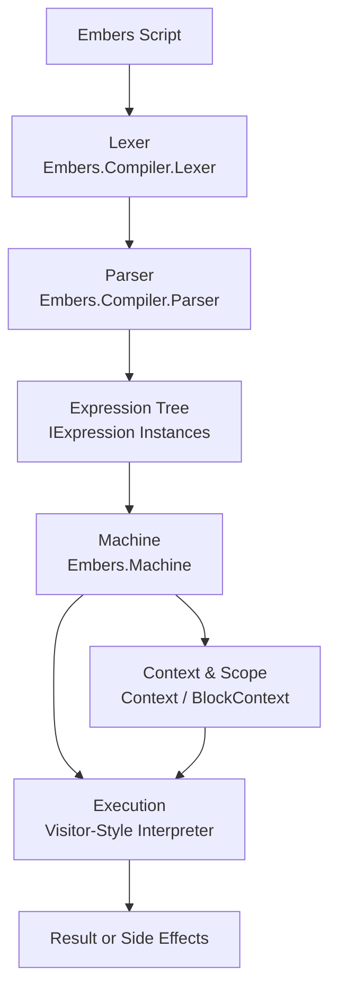
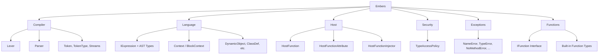

# Embers

[](https://www.nuget.org/packages/Embers.Runtime)
[](LICENSE)
[](https://github.com/kiebor81/embers/actions/workflows/build-and-test.yml)
[](https://github.com/kiebor81/embers/actions/workflows/release.yml)


**Embers** (Embedded Ruby Script) is a compact, embeddable Ruby-inspired interpreter written in C# for .NET 9. It is designed for applications that need a lightweight, scriptable runtime (e.g. games, tools, or plugin systems) without the overhead of creating and maintaining a complex, custom implementation.

In a nutshell:
> *Embers is intended for developers who want a structured scripting language integrated directly into their .NET applications, without outsourcing control to an external runtime.*

Embers is **not** a 1:1 implementation of Ruby in .NET. It is not IronRuby or a drop-in replacement for existing Ruby runtimes. Instead, it provides a deliberately scoped, Ruby-like language with familiar syntax and semantics, prioritising embeddability, extensibility, and host integration over parity-completeness.

Embers is an experimental runtime, inspired by and building upon earlier projects that are no longer actively maintained:
- [Embers by Joy-less](https://github.com/Joy-less/Embers)
- [RubySharp by AjLopez](https://github.com/ajlopez/RubySharp)

While a large portion of commonly used functions from Ruby's StdLib are present in the solution, full type binding and language coverage are intentionally incomplete; either out of scope or reserved for future development. Embers follows a strict architectural pattern, making it straightforward to extend, with features evolving and maturing as required.

## Overview

Embers is built around a clean, minimal core with the goal of executing Ruby-like scripts in constrained or embedded environments. The interpreter features:

- A recursive descent parser for Ruby-like syntax
- Lexical analysis via a custom `Lexer`
- A virtual execution engine (`Machine`)
- Context-sensitive execution (`Context`, `BlockContext`)
- Robust exception model mirroring Ruby's error semantics
- Embeddability and interoperability within .NET 9 projects

---

## Design

The following section is primarily useful for contributors or developers extending Embers, or those interested in the architectural patterns and topography of the solution.

### Execution Flow



### Logical Topography



## Projects

- `Embers`: Core interpreter (main focus)
- `Embers.Console`: Example CLI host for executing embers (`.rb`, `.rs`, `.ers`, `.emb`) scripts or launching an interactive REPL
- `Embers.Tests`: Unit and integration tests covering Embers' functionality

## Design Goals

- **Portability**: Target .NET 9 with minimal external dependencies
- **Embedding First**: Built to be embedded in other applications, not just run standalone
- **Ruby-Inspired**: Implements a Ruby-like language subset with idiomatic constructs
- **Simplicity**: Clear structure with low cognitive overhead for contributors
- **Performance**: Designed for fast startup and predictable execution in memory-limited contexts

## Key Components

- **Lexer** (`Compiler/Lexer.cs`): Tokenizes input strings into operators, literals, variables, etc.
- **Parser** (`Compiler/Parser.cs`): Converts tokens into expression trees (`IExpression`)
- **Machine** (`Machine.cs`): Executes expression trees using a visitor-style interpreter
- **Context & BlockContext**: Manages variable scopes, closures, and execution frames
- **Registration** (`Registration.cs`): Handles registration of built-in methods and object types
- **StdLib System** (`StdLib/`): Reflection-based standard library with automatic function discovery and registration
- **Exceptions**: Rich error handling mimicking Ruby (e.g., `NameError`, `NoMethodError`, `SyntaxError`)

## Usage

### Embedding the Interpreter

You can embed Embers in any .NET 9 project:

```csharp
var machine = new Machine();
machine.Execute("puts 'Hello from Embers!'");
```

#### Execution Methods

The `Machine` exposes three execution entry points:

- `ExecuteText(string code)`  
  Parses and executes Embers code directly from a string.

- `ExecuteFile(string path)`  
  Parses and executes an Embers script from a file on disk.

- `Execute(string input)`  
  Convenience method that proxies to `ExecuteFile` or `ExecuteText` based on whether the input resolves to an existing file path.

**Note**:  
`Execute` determines whether to treat its input as a file path using `File.Exists`.

If the input appears to be a file path (e.g. contains path separators, file extensions, or is rooted) but does not resolve to an existing file, `Execute` will throw a `FileNotFoundException` rather than attempting to execute it as code.

> For explicit intent and clarity, prefer calling `ExecuteText` or `ExecuteFile` directly.

---

## Script Syntax

Embers supports a [substantial Ruby-like syntax](Grammar.md):

```ruby
def square(x)
  x * x
end

puts square(10)  # => 100
```

Supports:

- Method definitions
- Variable assignments
- Control structures (`if`, `unless`, `while`, etc.)
- Class and instance variables (`@foo`, `@@bar`)
- Exceptions (`raise`, `begin/rescue/ensure/end`)
- Instance methods on native types (e.g., `5.abs`, `3.14.ceil`, `now.year`)
- C# interop via direct .NET type access (e.g., `System.DateTime.Now`)

**Note**:
Availability of .NET types depends on the configured type access policy.

---

## Security Configuration

Embers' C# interop is powerful, but allowing any foreign code execution complete and unfettered access to .NET at runtime, can be equally dangerous and allows for potential malicious code injection. To combat this, Embers includes a host-level **type access policy** system to restrict which .NET types and namespaces can be accessed or exposed to the interpreter. This system is defined in `Embers.Security.TypeAccessPolicy` and enforces security through two modes:

### Security Modes

```csharp
public enum SecurityMode
{
    Unrestricted,    // All types are accessible
    WhitelistOnly    // Only whitelisted types and namespaces are allowed
}
```

- **Unrestricted**: Default mode. All types are permitted.
- **WhitelistOnly**: Only explicitly allowed types or namespaces can be accessed.

### Under the Hood

Allowed types and namespaces are configured in the policy:

```csharp
TypeAccessPolicy.SetPolicy(new[]
{
    "MyApp.API.SafeClass",
    "MyApp.Scripting.*"
}, SecurityMode.WhitelistOnly);
```

This example:
- Allows the specific type `MyApp.API.SafeClass`
- Allows all types under the `MyApp.Scripting` namespace

### Fine-Grained Controls

Policy can be manipulated at runtime by your host application:

```csharp
TypeAccessPolicy.AddType("MyApp.Tools.ScriptableAction");
TypeAccessPolicy.AddNamespace("MyApp.Sandbox");
```

To reset all policies:

```csharp
TypeAccessPolicy.Clear();
```

### Configuring the Policy

`TypeAccessPolicy` is internal only. For embedded, pre-shipped, or user-authored scripts, it is strongly recommended to use `WhitelistOnly` mode.

The policy is governed by the machine (runtime) instance via the public API:

```csharp
        /// <summary>
        /// Sets the type access policy.
        /// Allowed entries are a list of full type names that are allowed to be accessed.
        /// Provide allowed entries as a list of strings where final character '.' implies a namespace.
        /// </summary>
        /// <param name="allowedEntries">The allowed entries.</param>
        public void SetTypeAccessPolicy(IEnumerable<string> allowedEntries, SecurityMode mode = SecurityMode.WhitelistOnly)
        {
            TypeAccessPolicy.SetPolicy(allowedEntries, mode);
        }

        /// <summary>
        /// Allows the type.
        /// </summary>
        /// <param name="fullTypeName">Full name of the type.</param>
        public void AllowType(string fullTypeName)
        {
            Security.TypeAccessPolicy.AddType(fullTypeName);
        }

        /// <summary>
        /// Allows the namespace.
        /// </summary>
        /// <param name="prefix">The prefix.</param>
        public void AllowNamespace(string prefix)
        {
            Security.TypeAccessPolicy.AddNamespace(prefix);
        }

        /// <summary>
        /// Clears the security policy.
        /// </summary>
        public void ClearSecurityPolicy()
        {
            Security.TypeAccessPolicy.Clear();
        }
```

### Runtime Enforcement

Any type lookups during execution check against this policy:

```csharp
if (!TypeAccessPolicy.IsAllowed(fullTypeName))
    throw new TypeAccessError(...);
```

This ensures unregistered types are never exposed to interpreted code under `WhitelistOnly` mode.

---

## Building a Custom DSL

Embers enables you to define host-side .NET methods as callable functions within Ruby-like scripts. This is the foundation for building domain-specific languages (DSLs) tailored to your application's runtime while encapsulating host functionality behind a stable scripting interface.

### Define a Host Function

To define an Embers-callable host function:

1. Inherit from `HostFunction` (defined in `Embers.Host.HostFunction`)
2. Decorate the class with `[HostFunction(...)]` and provide one or more Embers-visible names
3. Implement the `Apply` method

#### Example

```csharp
using Embers.Host;
using Embers.Language;

[HostFunction("hello")]
internal class HelloFunction : HostFunction
{
    public override object Apply(DynamicObject self, Context context, IList<object> values)
    {
        Console.WriteLine("Hello from Embers!");
        return null;
    }
}
```

### Register Functions with the Machine

Use `HostFunctionInjector` to automatically discover and register all `[HostFunction]` classes:

```csharp
Machine machine = new();
machine.InjectFromCallingAssembly();
machine.ExecuteText("hello"); // prints "Hello from Embers!"
```

You can also inject from a specific assembly or all referenced ones if you are following a plugin architecture or have separated your DSL across projects:

```csharp
machine.InjectFromAssembly(typeof(MyDSLClass).Assembly);
machine.InjectFromReferencedAssemblies();
```

### Multiple Names and Composition

You can expose a function under multiple aliases:

```csharp
[HostFunction("guid", "generate_guid")]
internal class GuidFunction : HostFunction
{
    public override object Apply(DynamicObject self, Context context, IList<object> values)
    {
        return Guid.NewGuid().ToString();
    }
}
```

Then from Embers:

```ruby
puts guid
puts generate_guid
```

---

## Function Documentation & Introspection

Embers supports method-level documentation attributes for both host functions and standard library functions. These attributes are intended to support tooling such as REPL help, documentation generation, and editor integrations.

Documentation metadata is extracted at runtime via reflection and does not affect execution behaviour. All documentation attributes are optional; functions without annotations will still be discovered and executed normally.

### Supported Attributes

The following attributes can be applied to the `Apply` method of any `IFunction` implementation:

`CommentsAttribute`

Provides high-level descriptive text for the function.

e.g.

```csharp
[Comments(
    "Prints a message to the host output.",
    "Primarily intended for debugging or logging."
)]
```

`ArgumentsAttribute`

Describes parameter names and expected types.

e.g.

```csharp
[Arguments(
    ParamNames = new[] { "message" },
    ParamTypes = new[] { typeof(string) }
)]
```

`ReturnsAttribute`

Specifies the return type for documentation purposes.

e.g.

```csharp
[Returns(ReturnType = typeof(void))]
```

Complete example:

```csharp
[HostFunction("hello")]
internal class HelloFunction : HostFunction
{
    [Comments("Prints a greeting message.")]
    [Arguments(ParamNames = new[] { "message" }, ParamTypes = new[] { typeof(string) })]
    [Returns(ReturnType = typeof(void))]
    public override object Apply(DynamicObject self, Context context, IList<object> values)
    {
        Console.WriteLine($"Hello {values[0]}");
        return null;
    }
}
```

### Runtime Discovery

At runtime, host applications can scan all loaded assemblies to extract documentation metadata from functions. This is performed by the `FunctionScanner` and produces a structured representation of available functions and their signatures.

This mechanism is intended for tooling and introspection and may be used by hosts to implement features such as:
- REPL `help` commands
- Auto-generated documentation
- Editor hints or completions

`FunctionScanner.ScanFunctionDocumentation()` returns a dictionary mapping function aliases to structured documentation data (comments, arguments, and return information).

The format and presentation of this information should be entirely host-defined when consumed.

An example `help` function may resemble

```csharp
// Example host-defined help command using function annotations
[HostFunction("help")]
internal class HelpFunction : HostFunction
{
    // add attributes for self documentation
    [Comments("Provides method look-up and documentation.", "Prints results to console.")]
    [Arguments(ParamNames = new[] { "method_name" }, ParamTypes = new[] { typeof(string) })]
    [Returns(ReturnType = typeof(void))]
    public override object Apply(DynamicObject self, Context context, IList<object> values)
    {

        var documentation_dict = Annotations.FunctionScanner.ScanFunctionDocumentation();

        IEnumerable<string> keysToDisplay;

        // did user provide a method name as string to lookup?
        // format help "<<METHOD_NAME>>"
        // if they did, find that method and return
        // otherwise get the full list
        if (values == null || values.Count == 0)
        {
            keysToDisplay = documentation_dict.Keys;
        }
        else
        {
            var lookupKey = values[0].ToString();
            keysToDisplay = documentation_dict.Keys.Where(k => 
            {
                var keyParts = k.Split(',').Select(p => p.Trim());
                return keyParts.Contains(lookupKey);
            });
        }

        // extract documentation and write to console output
        foreach (var key in keysToDisplay)
        {
            System.Console.WriteLine($"Method: {key}");
            var doc = documentation_dict[key];
            
            if (!string.IsNullOrEmpty(doc.Comments))
                System.Console.WriteLine($"  Comments: {doc.Comments}");
            
            if (!string.IsNullOrEmpty(doc.Arguments))
                System.Console.WriteLine($"  Arguments: {doc.Arguments}");
            
            if (!string.IsNullOrEmpty(doc.Returns))
                System.Console.WriteLine($"  Returns: {doc.Returns}");

            System.Console.WriteLine("");

        }

        return null;
    }
}
```

This mechanism is intended to enable rich developer tooling without coupling Embers to any specific user interface or documentation format.

#### Exclude From Discovery

To exclude a function from this mechanism, `ScannerIgnoreAttribute` can be applied to the function class.

e.g.

```csharp
[HostFunction("awesome"), ScannerIgnore]
internal class AwesomeFunction : HostFunction { }
```

This is useful for internal, experimental, iterative, or implementation-detail functions that should not appear in tooling output.

---

## StdLib Function Registration

Embers includes a reflection-based standard library system for automatic function discovery and registration. Functions can be registered as global methods or as instance methods on native types (Ruby types mapped onto underlying C# representations).

### Define a StdLib Function

1. Inherit from your function base class
2. Decorate with `[StdLib(...)]` attribute
3. Specify target types for instance method registration

#### Global Function Example

```csharp
using Embers.StdLib;

[StdLib("abs")]
public class AbsFunction : StdFunction
{
    public object Apply(Context context, IList<object> values)
    {
        var num = values[0];
        return num switch
        {
            int i => Math.Abs(i),
            double d => Math.Abs(d),
            _ => throw new TypeError($"Invalid type for abs: {num?.GetType()}")
        };
    }
}
```

#### Instance Method Example

Register a function on multiple types using `TargetTypes`:

```csharp
[StdLib("abs", TargetTypes = new[] { "Fixnum", "Float" })]
public class AbsFunction : StdFunction
{
    public object Apply(Context context, IList<object> values)
    {
        // values[0] contains the receiver (self)
        var num = values[0];
        return num switch
        {
            int i => Math.Abs(i),
            double d => Math.Abs(d),
            _ => throw new TypeError($"Invalid type for abs: {num?.GetType()}")
        };
    }
}
```

Now callable as both global and instance methods:

```ruby
abs(-5)      # => 5 (global)
(-5).abs     # => 5 (instance method on Fixnum)
(-3.14).abs  # => 3.14 (instance method on Float)
```

### Native Types

Embers maps Ruby types to C# types through `NativeClass`:

- **Fixnum** → `int` / `long`
- **Float** → `double`
- **String** → `string`
- **Array** → `List<object>`
- **Hash** → `Dictionary<object, object>`
- **DateTime** → `System.DateTime`
- **NilClass** → `null`
- **Range** → `Range`

### Automatic Discovery

The `StdLibRegistry` automatically discovers all `[StdLib]` decorated functions at runtime:

```csharp
var machine = new Machine();
// StdLib functions are automatically registered during Machine initialization
machine.ExecuteText("puts 5.abs");     // => 5
machine.ExecuteText("puts (-10).abs"); // => 10
```

For more details and if you would like to help build on Embers thorugh contributing StdLib functions, see [STDLIB.md](STDLIB.md).

---

## Practical Use Cases

Embers is designed for embedding into diverse .NET applications. For in-depth examples, see [Examples](Examples.md)

---

## License

MIT License
