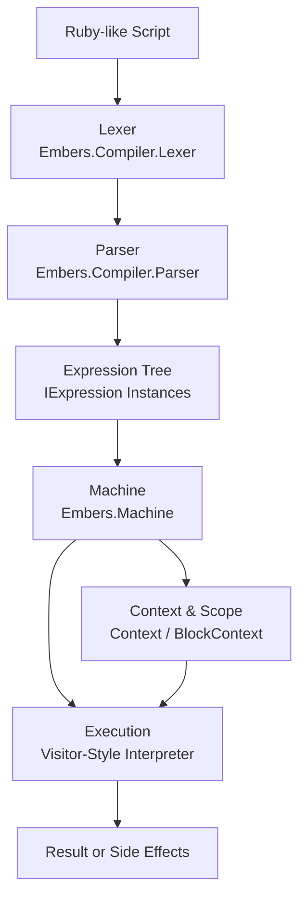
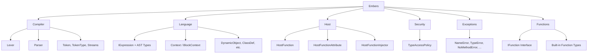

# Embers

[](https://www.nuget.org/packages/Embers.Runtime)
[](LICENSE)
[](https://github.com/kiebor81/embers/actions/workflows/build-and-test.yml)
[](https://github.com/kiebor81/embers/actions/workflows/release.yml)


**Embers** (Embedded Ruby Script) is a compact, embeddable Ruby-inspired interpreter written in C# for .NET 9. It is designed for applications that need a lightweight, scriptable runtime (e.g. games, tools, or plugin systems) without the overhead of creating and maintaining a complex, custom implementation.

In a nutshell:
> *Embers is intended for developers who want a structured scripting language integrated directly into their .NET applications, without outsourcing control to an external runtime.*

Embers is **not** a 1:1 implementation of Ruby in .NET. It is not IronRuby or a drop-in replacement for existing Ruby runtimes. Instead, it provides a deliberately scoped, Ruby-like language with familiar syntax and semantics, prioritising embeddability, extensibility, and host integration over parity-completeness.

Embers is an experimental runtime, inspired by and building upon earlier projects that are no longer actively maintained:
- [Embers by Joy-less](https://github.com/Joy-less/Embers)
- [RubySharp by AjLopez](https://github.com/ajlopez/RubySharp)

While a large portion of commonly used functions from Ruby's StdLib are present in the solution, full type binding and language coverage are intentionally incomplete; either out of scope or reserved for future development. Embers follows a strict architectural pattern, making it straightforward to extend, with features evolving and maturing as required.

## Overview

Embers is built around a clean, minimal core with the goal of executing Ruby-like scripts in constrained or embedded environments. The interpreter features:

- A recursive descent parser for Ruby-like syntax
- Lexical analysis via a custom `Lexer`
- A virtual execution engine (`Machine`)
- Context-sensitive execution (`Context`, `BlockContext`)
- Robust exception model mirroring Ruby's error semantics
- Embeddability and interoperability within .NET 9 projects

---

## Design

The following section is primarily useful for contributors or developers extending Embers, or those interested in the architectural patterns and topography of the solution.

### Execution Flow



### Logical Topography



## Projects

- `Embers`: Core interpreter (main focus)
- `Embers.Console`: Example CLI host for executing embers (`.rb`, `.rs`, `.ers`, `.emb`) scripts or launching an interactive REPL
- `Embers.Tests`: Unit and integration tests covering Embers' functionality

## Design Goals

- **Portability**: Target .NET 9 with minimal external dependencies
- **Embedding First**: Built to be embedded in other applications, not just run standalone
- **Ruby-Inspired**: Implements a Ruby-like language subset with idiomatic constructs
- **Simplicity**: Clear structure with low cognitive overhead for contributors
- **Performance**: Designed for fast startup and predictable execution in memory-limited contexts

## Key Components

- **Lexer** (`Compiler/Lexer.cs`): Tokenizes input strings into operators, literals, variables, etc.
- **Parser** (`Compiler/Parser.cs`): Converts tokens into expression trees (`IExpression`)
- **Machine** (`Machine.cs`): Executes expression trees using a visitor-style interpreter
- **Context & BlockContext**: Manages variable scopes, closures, and execution frames
- **Registration** (`Registration.cs`): Handles registration of built-in methods and object types
- **StdLib System** (`StdLib/`): Reflection-based standard library with automatic function discovery and registration
- **Exceptions**: Rich error handling mimicking Ruby (e.g., `NameError`, `NoMethodError`, `SyntaxError`)

## Usage

### Embedding the Interpreter

You can embed Embers in any .NET 9 project:

```csharp
var machine = new Machine();
machine.Execute("puts 'Hello from Embers!'");
```

#### Execution Methods

The `Machine` exposes three execution entry points:

- `ExecuteText(string code)`  
  Parses and executes Embers code directly from a string.

- `ExecuteFile(string path)`  
  Parses and executes an Embers script from a file on disk.

- `Execute(string input)`  
  Convenience method that proxies to `ExecuteFile` or `ExecuteText` based on whether the input resolves to an existing file path.

**Note**:  
`Execute` determines whether to treat its input as a file path using `File.Exists`.

If the input appears to be a file path (e.g. contains path separators, file extensions, or is rooted) but does not resolve to an existing file, `Execute` will throw a `FileNotFoundException` rather than attempting to execute it as code.

> For explicit intent and clarity, prefer calling `ExecuteText` or `ExecuteFile` directly.

### CLI Usage (Example)

From `Embers.Console`:

```bash
dotnet run --project Embers.Console "script.rb"
```

Or launch the REPL:

```bash
dotnet run --project Embers.Console
```

Exit the REPL using `exit`, `quit`, or `bye` commands.

## Script Syntax

Embers supports a substantial Ruby-like syntax:

```ruby
def square(x)
  x * x
end

puts square(10)  # => 100
```

Supports:

- Method definitions
- Variable assignments
- Control structures (`if`, `unless`, `while`, etc.)
- Class and instance variables (`@foo`, `@@bar`)
- Exceptions (`raise`, `begin/rescue/ensure/end`)
- Instance methods on native types (e.g., `5.abs`, `3.14.ceil`, `now.year`)
- C# interop via direct .NET type access (e.g., `System.DateTime.Now`)

**Note**:
Availability of .NET types depends on the configured type access policy.

## Build & Test

### Build

```bash
dotnet build
```

### Run Tests

```bash
dotnet test Embers.Tests
```

---

## Security Configuration

Embers' Ruby-C# interop is powerful, but allowing any foreign code execution complete and unfettered access to .NET at runtime, can be equally dangerous and allows for potential malicious code injection. To combat this, Embers includes a host-level **type access policy** system to restrict which .NET types and namespaces can be accessed or exposed to the interpreter. This system is defined in `Embers.Security.TypeAccessPolicy` and enforces security through two modes:

### Security Modes

```csharp
public enum SecurityMode
{
    Unrestricted,    // All types are accessible
    WhitelistOnly    // Only whitelisted types and namespaces are allowed
}
```

- **Unrestricted**: Default mode. All types are permitted.
- **WhitelistOnly**: Only explicitly allowed types or namespaces can be accessed.

### Under the Hood

Allowed types and namespaces are configured in the policy:

```csharp
TypeAccessPolicy.SetPolicy(new[]
{
    "MyApp.API.SafeClass",
    "MyApp.Scripting.*"
}, SecurityMode.WhitelistOnly);
```

This example:
- Allows the specific type `MyApp.API.SafeClass`
- Allows all types under the `MyApp.Scripting` namespace

### Fine-Grained Controls

Policy can be manipulated at runtime by your host application:

```csharp
TypeAccessPolicy.AddType("MyApp.Tools.ScriptableAction");
TypeAccessPolicy.AddNamespace("MyApp.Sandbox");
```

To reset all policies:

```csharp
TypeAccessPolicy.Clear();
```

### Configuring the Policy

`TypeAccessPolicy` is internal only. For embedded, pre-shipped, or user-authored scripts, it is strongly recommended to use `WhitelistOnly` mode.

The policy is governed by the machine (runtime) instance via the public API:

```csharp
        /// <summary>
        /// Sets the type access policy.
        /// Allowed entries are a list of full type names that are allowed to be accessed.
        /// Provide allowed entries as a list of strings where final character '.' implies a namespace.
        /// </summary>
        /// <param name="allowedEntries">The allowed entries.</param>
        public void SetTypeAccessPolicy(IEnumerable<string> allowedEntries, SecurityMode mode = SecurityMode.WhitelistOnly)
        {
            TypeAccessPolicy.SetPolicy(allowedEntries, mode);
        }

        /// <summary>
        /// Allows the type.
        /// </summary>
        /// <param name="fullTypeName">Full name of the type.</param>
        public void AllowType(string fullTypeName)
        {
            Security.TypeAccessPolicy.AddType(fullTypeName);
        }

        /// <summary>
        /// Allows the namespace.
        /// </summary>
        /// <param name="prefix">The prefix.</param>
        public void AllowNamespace(string prefix)
        {
            Security.TypeAccessPolicy.AddNamespace(prefix);
        }

        /// <summary>
        /// Clears the security policy.
        /// </summary>
        public void ClearSecurityPolicy()
        {
            Security.TypeAccessPolicy.Clear();
        }
```

### Runtime Enforcement

Any type lookups during execution check against this policy:

```csharp
if (!TypeAccessPolicy.IsAllowed(fullTypeName))
    throw new TypeAccessError(...);
```

This ensures unregistered types are never exposed to interpreted code under `WhitelistOnly` mode.

---

## Building a Custom DSL

Embers enables you to define host-side .NET methods as callable functions within Ruby-like scripts. This is the foundation for building domain-specific languages (DSLs) tailored to your application's runtime while encapsulating host functionality behind a stable scripting interface.

### Define a Host Function

To define a Ruby-callable host function:

1. Inherit from `HostFunction` (defined in `Embers.Host.HostFunction`)
2. Decorate the class with `[HostFunction(...)]` and provide one or more Ruby-visible names
3. Implement the `Apply` method

#### Example

```csharp
using Embers.Host;
using Embers.Language;

[HostFunction("hello")]
internal class HelloFunction : HostFunction
{
    public override object Apply(DynamicObject self, Context context, IList<object> values)
    {
        Console.WriteLine("Hello from Embers!");
        return null;
    }
}
```

### Register Functions with the Machine

Use `HostFunctionInjector` to automatically discover and register all `[HostFunction]` classes:

```csharp
Machine machine = new();
machine.InjectFromCallingAssembly();
machine.ExecuteText("hello"); // prints "Hello from Embers!"
```

You can also inject from a specific assembly or all referenced ones if you are following a plugin architecture or have separated your DSL across projects:

```csharp
machine.InjectFromAssembly(typeof(MyDSLClass).Assembly);
machine.InjectFromReferencedAssemblies();
```

### Multiple Names and Composition

You can expose a function under multiple aliases:

```csharp
[HostFunction("guid", "generate_guid")]
internal class GuidFunction : HostFunction
{
    public override object Apply(DynamicObject self, Context context, IList<object> values)
    {
        return Guid.NewGuid().ToString();
    }
}
```

Then from Embers:

```ruby
puts guid
puts generate_guid
```

---

## StdLib Function Registration

Embers includes a reflection-based standard library system for automatic function discovery and registration. Functions can be registered as global methods or as instance methods on native types (Ruby types mapped onto underlying C# representations).

### Define a StdLib Function

1. Inherit from your function base class
2. Decorate with `[StdLib(...)]` attribute
3. Specify target types for instance method registration

#### Global Function Example

```csharp
using Embers.StdLib;

[StdLib("abs")]
public class AbsFunction : IFunction
{
    public object Apply(Context context, IList<object> values)
    {
        var num = values[0];
        return num switch
        {
            int i => Math.Abs(i),
            double d => Math.Abs(d),
            _ => throw new TypeError($"Invalid type for abs: {num?.GetType()}")
        };
    }
}
```

#### Instance Method Example

Register a function on multiple types using `TargetTypes`:

```csharp
[StdLib("abs", TargetTypes = new[] { "Fixnum", "Float" })]
public class AbsFunction : IFunction
{
    public object Apply(Context context, IList<object> values)
    {
        // values[0] contains the receiver (self)
        var num = values[0];
        return num switch
        {
            int i => Math.Abs(i),
            double d => Math.Abs(d),
            _ => throw new TypeError($"Invalid type for abs: {num?.GetType()}")
        };
    }
}
```

Now callable as both global and instance methods:

```ruby
abs(-5)      # => 5 (global)
(-5).abs     # => 5 (instance method on Fixnum)
(-3.14).abs  # => 3.14 (instance method on Float)
```

### Native Types

Embers maps Ruby types to C# types through `NativeClass`:

- **Fixnum** → `int`
- **Float** → `double`
- **String** → `string`
- **Array** → `List<object>`
- **Hash** → `Dictionary<object, object>`
- **DateTime** → `System.DateTime`
- **NilClass** → `null`
- **TrueClass** / **FalseClass** → `bool`
- **Range** → `Range`

### Automatic Discovery

The `StdLibRegistry` automatically discovers all `[StdLib]` decorated functions at runtime:

```csharp
var machine = new Machine();
// StdLib functions are automatically registered during Machine initialization
machine.ExecuteText("puts 5.abs");     // => 5
machine.ExecuteText("puts (-10).abs"); // => 10
```

For more details and if you would like to help build on Embers thorugh contributing StdLib functions, see [STDLIB.md](STDLIB.md).

---

## Practical Use Cases

Embers is designed for embedding into diverse .NET applications. The following are detailed, real-world scenarios demonstrating how to integrate Embers into your projects. These examples demonstrate advanced embedding scenarios. 

If you're evaluating Embers conceptually, you may wish to skim this section.

---

### 1. Game Scripting in Godot (Dynamic Node Interaction & Autoloads)

**Use Case**: Enable game designers to script behaviors, quest logic, and NPC interactions in Ruby without recompiling the game.

#### Dynamic Node Interaction

Expose Godot nodes to Ruby scripts for real-time manipulation:

```csharp
using Embers;
using Embers.Host;
using Godot;

public partial class RubyGameScript : Node
{
    private Machine embers;
    
    public override void _Ready()
    {
        embers = new Machine();
        
        // Register host functions for node access
        embers.InjectFromCallingAssembly();
        
        // Pass Godot context to Ruby
        embers.RootContext.SetLocalValue("scene", GetTree().Root);
        embers.RootContext.SetLocalValue("player", GetNode<CharacterBody2D>("Player"));
        
        // Load and execute quest script
        string questScript = FileAccess.Open("res://scripts/quest_01.rb", FileAccess.ModeFlags.Read).GetAsText();
        embers.ExecuteFile(questScript);
    }
}

// Host function for finding nodes
[HostFunction("find_node")]
internal class FindNodeFunction : HostFunction
{
    public override object Apply(DynamicObject self, Context context, IList<object> values)
    {
        var nodePath = values[0].ToString();
        var scene = context.GetLocalValue("scene") as Node;
        return scene?.GetNode(nodePath);
    }
}

// Host function for spawning enemies
[HostFunction("spawn_enemy")]
internal class SpawnEnemyFunction : HostFunction
{
    public override object Apply(DynamicObject self, Context context, IList<object> values)
    {
        var enemyType = values[0].ToString();
        var x = Convert.ToDouble(values[1]);
        var y = Convert.ToDouble(values[2]);
        
        var scene = context.GetLocalValue("scene") as Node;
        var enemyScene = GD.Load<PackedScene>($"res://enemies/{enemyType}.tscn");
        var enemy = enemyScene.Instantiate<Node2D>();
        enemy.Position = new Vector2((float)x, (float)y);
        scene.AddChild(enemy);
        
        return enemy;
    }
}
```

**Ruby Quest Script** (`quest_01.rb`):

```ruby
# Dynamic quest behavior
def on_quest_trigger
  puts "Quest started!"
  
  # Spawn enemies dynamically
  spawn_enemy("goblin", 100, 200)
  spawn_enemy("goblin", 150, 200)
  
  # Find and modify UI
  ui = find_node("UI/QuestPanel")
  ui.Visible = true
  ui.GetNode("Label").Text = "Defeat the goblins!"
end

# Enemy AI behavior
def enemy_think(enemy)
  player = $player
  distance = enemy.Position.DistanceTo(player.Position)
  
  if distance < 100
    # Chase player
    direction = (player.Position - enemy.Position).Normalized()
    enemy.Velocity = direction * 50
  else
    # Patrol
    enemy.Velocity = System::Vector2.new(0, 0)
  end
end
```

#### Autoload Integration

Create a Godot autoload singleton for global scripting:

```csharp
    [GlobalClass]
    public partial class Runtime : Node
    {
        private Machine Machine { get; set; }

        private System.Collections.Generic.Dictionary<string, string> LoadedScripts { get; set; } = [];

        private string ScriptContext => string.Join("\n", LoadedScripts.Values);

        public override void _Ready()
        {
            Machine = new Machine();
            Machine.InjectFromCallingAssembly();
            LoadGlobalScripts("res://autoloads/");
            GD.Print("Embers Engine initialized");
        }

        private void LoadGlobalScripts(string directory)
        {
            var dir = DirAccess.Open(directory);
            if (dir != null)
            {
                dir.ListDirBegin();
                string fileName = dir.GetNext();

                while (fileName != "")
                {
                    if (fileName.EndsWith(".rb"))
                    {
                        string script = FileAccess.Open($"{directory}{fileName}", FileAccess.ModeFlags.Read).GetAsText();
                        LoadedScripts[fileName.Replace(".rb", "")] = script;
                        GD.Print($"Loaded Ruby autoload: {fileName}");
                    }
                    fileName = dir.GetNext();
                }
            }
        }

        public Variant Execute(string functionName, Array args)
        {
            var embersArgs = string.Join(", ", args.Select(ToEmbersLiteral));
            string call =
                $"{ScriptContext}\n{functionName}({embersArgs})";

            return ToGodotVariant(Machine.Execute(call));
        }

        private static string ToEmbersLiteral(Variant v)
        {
            switch (v.VariantType)
            {
                case Variant.Type.Nil:
                    return "nil";

                case Variant.Type.Bool:
                    return (bool)v ? "true" : "false";

                case Variant.Type.Int:
                    return ((long)v).ToString(CultureInfo.InvariantCulture);

                case Variant.Type.Float:
                    // Ruby wants dot decimal; invariant culture avoids commas.
                    return ((double)v).ToString(CultureInfo.InvariantCulture);

                case Variant.Type.String:
                    return $"\"{EscapeRubyString((string)v)}\"";

                case Variant.Type.Array:
                    {
                        var arr = (Array)v;
                        return "[" + string.Join(", ", arr.Select(ToEmbersLiteral)) + "]";
                    }

                case Variant.Type.Dictionary:
                    {
                        var dict = (Dictionary)v;
                        // Ruby hash: { "k" => v, "k2" => v2 }
                        var pairs = dict.Select(kv => $"{ToEmbersLiteral(kv.Key)} => {ToEmbersLiteral(kv.Value)}");
                        return "{ " + string.Join(", ", pairs) + " }";
                    }

                default:
                    // Fallback: pass as string literal so Ruby always parses
                    return $"\"{EscapeRubyString(v.ToString())}\"";
            }
        }

        private static string EscapeRubyString(string s) =>
            s.Replace("\\", "\\\\")
             .Replace("\"", "\\\"")
             .Replace("\n", "\\n")
             .Replace("\r", "\\r")
             .Replace("\t", "\\t");

        private static Variant ToGodotVariant(object? value)
        {
            if (value == null)
                return new Variant(); // Return default-constructed Variant for 'nil'

            return value switch
            {
                bool b => b,
                int i => i,
                long l => (double)l,
                float f => (double)f,
                double d => d,
                string s => s,

                // Godot types (if Embers ever returns them from a Host Function)
                GodotObject o => o,
                _ => value.ToString() ?? ""
            };
        }

    }
```

**Global Ruby Script** (`/autoloads/game_utils.rb`):

```ruby
# Global utility functions available throughout the game
def calculate_damage(attacker_level, defender_level, base_damage)
  multiplier = 1.0 + ((attacker_level - defender_level) * 0.1)
  (base_damage * multiplier).to_i.clamp(1, 9999)
end
```

Then call from any gdscript:

```gdscript
var damage = Embers.Execute("calculate_damage", [10, 5, 25])
print("Damage dealt: %s" % damage);
```

```c#
var embers_engine = GetNode<RubyEngine>("/root/RubyEngine");
var damage = embers_engine.Execute("calculate_damage", [10, 5, 25])
GD.Print($"Damage dealt: {damage}");
```

---

### 2. User-Generated Content in .NET Desktop Applications

**Use Case**: Allow end-users to create plugins, mods, or automation scripts for your desktop application.

#### Building a User-Friendly DSL for a File Organizer Tool

```csharp
using Embers;
using Embers.Host;
using System.IO;

public class FileOrganizerApp
{
    private Machine rubyEngine;
    
    public FileOrganizerApp()
    {
        rubyEngine = new Machine();
        
        // Configure security - only allow safe file operations
        rubyEngine.SetTypeAccessPolicy(new[]
        {
            "System.IO.File",
            "System.IO.Directory",
            "System.IO.Path",
            "System.IO.FileInfo",
            "System.Text.RegularExpressions.*"
        }, SecurityMode.WhitelistOnly);
        
        // Inject custom DSL functions
        rubyEngine.InjectFromCallingAssembly();
        
        // Load user scripts from app data
        LoadUserScripts();
    }
    
    public void ExecuteUserRule(string ruleName)
    {
        rubyEngine.ExecuteText($"run_rule('{ruleName}')");
    }
    
    private void LoadUserScripts()
    {
        string scriptsPath = Path.Combine(
            Environment.GetFolderPath(Environment.SpecialFolder.ApplicationData),
            "FileOrganizer", "Scripts"
        );
        
        if (Directory.Exists(scriptsPath))
        {
            foreach (var file in Directory.GetFiles(scriptsPath, "*.rb"))
            {
                try
                {
                    string script = File.ReadAllText(file);
                    rubyEngine.ExecuteFile(script);
                    Console.WriteLine($"Loaded rule: {Path.GetFileName(file)}");
                }
                catch (Exception ex)
                {
                    Console.WriteLine($"Error loading {file}: {ex.Message}");
                }
            }
        }
    }
}

// DSL: Simple file matching and actions
[HostFunction("files_matching")]
internal class FilesMatchingFunction : HostFunction
{
    public override object Apply(DynamicObject self, Context context, IList<object> values)
    {
        var pattern = values[0].ToString();
        var directory = values.Count > 1 ? values[1].ToString() : Directory.GetCurrentDirectory();
        
        var regex = new System.Text.RegularExpressions.Regex(pattern);
        return Directory.GetFiles(directory)
            .Where(f => regex.IsMatch(Path.GetFileName(f)))
            .ToList();
    }
}

[HostFunction("move_to")]
internal class MoveToFunction : HostFunction
{
    public override object Apply(DynamicObject self, Context context, IList<object> values)
    {
        var filePath = values[0].ToString();
        var destination = values[1].ToString();
        
        Directory.CreateDirectory(destination);
        string fileName = Path.GetFileName(filePath);
        string destPath = Path.Combine(destination, fileName);
        
        File.Move(filePath, destPath, overwrite: true);
        return destPath;
    }
}

[HostFunction("older_than_days")]
internal class OlderThanDaysFunction : HostFunction
{
    public override object Apply(DynamicObject self, Context context, IList<object> values)
    {
        var filePath = values[0].ToString();
        var days = Convert.ToInt32(values[1]);
        
        var fileInfo = new FileInfo(filePath);
        return (DateTime.Now - fileInfo.LastWriteTime).TotalDays > days;
    }
}

[HostFunction("file_size_mb")]
internal class FileSizeMbFunction : HostFunction
{
    public override object Apply(DynamicObject self, Context context, IList<object> values)
    {
        var filePath = values[0].ToString();
        var fileInfo = new FileInfo(filePath);
        return fileInfo.Length / (1024.0 * 1024.0);
    }
}
```

**User Script Example** (`organize_downloads.rb`):

```ruby
# User-created automation rule
def organize_downloads
  downloads = "C:/Users/#{System::Environment.UserName}/Downloads"
  
  # Organize images
  files_matching('.*\.(jpg|png|gif)$', downloads).each do |file|
    if older_than_days(file, 30)
      move_to(file, "#{downloads}/Archive/Images")
      puts "Archived old image: #{file}"
    else
      move_to(file, "#{downloads}/Images")
      puts "Organized image: #{file}"
    end
  end
  
  # Organize large files
  files_matching('.*', downloads).each do |file|
    if file_size_mb(file) > 100
      move_to(file, "#{downloads}/Large Files")
      puts "Moved large file: #{file}"
    end
  end
  
  # Organize by file type
  organize_by_extension(downloads, 'pdf', 'Documents/PDFs')
  organize_by_extension(downloads, 'zip', 'Archives')
  organize_by_extension(downloads, 'exe', 'Installers')
end

def organize_by_extension(base_dir, ext, target_folder)
  files_matching(".*\\.#{ext}$", base_dir).each do |file|
    move_to(file, "#{base_dir}/#{target_folder}")
  end
end

# Register this rule
def run_rule(name)
  organize_downloads if name == 'downloads'
end
```

**User-Facing Interface**:

```csharp
// In your WPF/WinForms/Avalonia UI
private void btnRunRule_Click(object sender, EventArgs e)
{
    var organizer = new FileOrganizerApp();
    organizer.ExecuteUserRule("downloads");
    MessageBox.Show("Files organized successfully!");
}

// Script editor for users
private void btnEditScript_Click(object sender, EventArgs e)
{
    string scriptPath = Path.Combine(
        Environment.GetFolderPath(Environment.SpecialFolder.ApplicationData),
        "FileOrganizer", "Scripts", "organize_downloads.rb"
    );
    
    // Open in built-in editor or system default
    Process.Start("notepad.exe", scriptPath);
}
```

---

### 3. Plugin System with Sandboxing

**Use Case**: Allow third-party developers to extend your application safely.

```csharp
public class PluginManager
{
    public void LoadPlugin(string pluginPath)
    {
        var machine = new Machine();
        
        // Strict sandboxing - only expose plugin API
        machine.SetTypeAccessPolicy(new[]
        {
            "MyApp.PluginAPI.*"
        }, SecurityMode.WhitelistOnly);
        
        // Isolated context per plugin
        machine.ExecuteText(File.ReadAllText(pluginPath));
    }
}
```

## Contributing

All public methods must have test coverage. PRs must include unit tests for new functionality.

## License

MIT License
